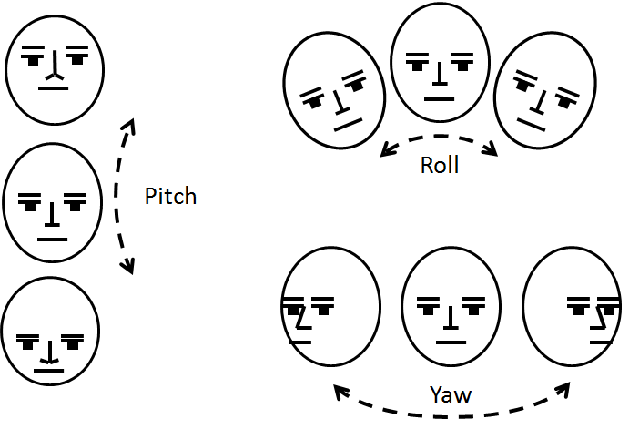

# headPoseEstimation 

 
 ## Table of contents
* [General info](#general-info)
* [Technologies](#technologies)
* [NOTE](#NOTE)

## General info
#### a face postion detection project . the system reads scans images of 2000 images  [AFLW2000-3D dataset] :
1.	Extract Features from Images using mediapipe and cv2 
2.	Extract Labels from matlab files using scipy.io 
    Labels consists of 3 angles [ pitch , yaw and roll] 
    
3.	Train Support Vector Regression (SVR) model to predict each angel 
4.	Test the model on video 
5.	Return video with Axis 
 

## Technologies
Project is implemented with:
* Python version: 3
* mediapipe and cv2 
* scipy
* Sklearn-SVR 
 ## NOTE :
 if you got this pesky error message “This notebook takes too much to render ” , you can check this url : https://nbviewer.org/github/noor-osama/headPoseEstimation-/blob/main/headPoseEstimation_collabVersion.ipynb . 
 It’s just an issue on GitHub’s end because it’s unable to render a preview of the file.
	
